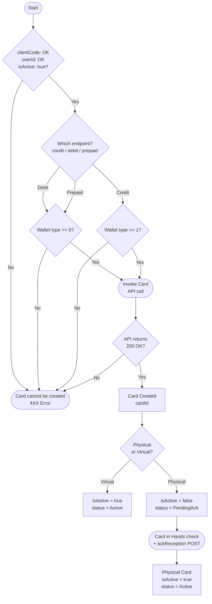

## **Visión General de los Flujos**

Los flujos para el uso de la API de NeoBank están categorizados según la entidad principal que registran, modifican o consultan. A un alto nivel, los flujos se correlacionan como se explica a continuación:
{class="img img-thin"}

---

## **Flujo de Usuarios**

La creación de nuevos UserIDs en la API de NeoBank sigue dos flujos separados según el tipo de persona que se va a ingresar en el sistema.

EndUser se refiere a los usuarios creados para personas físicas.
MerchantUser se refiere a los usuarios creados para entidades jurídicas.

>Es importante tener en cuenta que hay endpoints separados para la creación de EndUsers y MerchantUsers.

>Durante la exploración inicial, nuestro equipo de ventas debería haberte asignado los detalles específicos de los perfiles de tu programa de tarjetas, lo que definirá qué endpoint(s) debes llamar para la creación de usuarios y las obligaciones KYC pertinentes.

{class="img"}

---

## **Flujo de Tarjetas**

La API de NeoBank tiene llamadas diferenciadas para la creación de tarjetas de débito, crédito y prepago. A través de estas llamadas, es posible crear una tarjeta física o virtual para un UserID existente vinculado al saldo disponible en un WalletID específico de ese usuario.

Todas las tarjetas se crean utilizando un código de parametrización único para cada producto de tarjeta, que debe ser solicitado previamente al equipo de integración de PayCaddy.

La creación de una tarjeta comienza con la llamada post debitCard POST, creditCard POST o prepaidCard POST, dependiendo del servicio de emisión adquirido.

> Es importante considerar el tipo de usuario para el cual se ha parametrizado la tarjeta. Las tarjetas parametrizadas para personas físicas solo pueden crearse asociándolas con UserIDs que representen EndUsers, mientras que aquellas parametrizadas para entidades jurídicas solo pueden crearse asociándolas con MerchantUsers.

Una vez que se te haya otorgado un código de creación de tarjetas, podrás comenzar a probar la creación de tarjetas en el entorno de pruebas.

---
