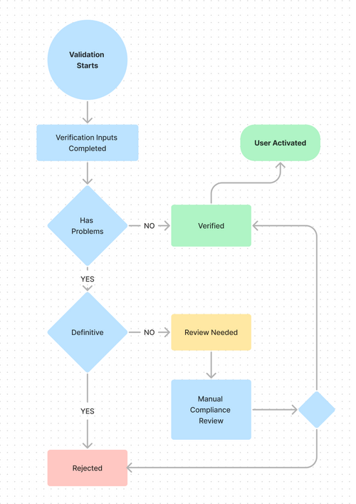

## **Notificaciones KYC integradas**

Como parte de nuestro flujo KYC integrado para personas físicas, después de que los usuarios completen los pasos de verificación de identidad en la URL compartida en el campo **kycURL** (consulte el POST de usuario final)**, el sistema de nuestro proveedor de verificación de identidad procesa los datos enviados y los compara con listas negras y realiza verificaciones AML. Nuestra API aprovecha estas verificaciones y proporciona notificaciones de estado a través de webhook.

Para recibir correctamente las notificaciones de las verificaciones KYC, es necesario mantener una URL para recibir mensajes de la API de PayCaddy a través de webhook. Debe comunicarse con el equipo de integración de PayCaddy para configurar el envío de notificaciones a esa URL.

### **Webhooks de verificación KYC**

El webhook de validación KYC (Know Your Customer) es una notificación que se envía a los clientes con información relevante sobre el estado del proceso de verificación KYC. La información se entrega en formato JSON y puede incluir diferentes estados y descripciones, según los casos de verificación.

| **Campo** | **Descripción** |
| ------------- | ------------- |
| **metadata** | Información crucial para identificar al usuario en forma de su **userId** |
| **status** | El estado de la verificación KYC, que puede ser "verificado", "rechazado" o "revisión necesaria" |
| **description** | Una descripción detallada del estado de la verificación. |
| **fullName** | El nombre completo del usuario |
| **age** | La edad del usuario |
| **Timestamp** | La marca de tiempo ISO 8601 de la respuesta de los webhooks |

```json
    {
        "metadata": {
            "userId": "string"
        },
        "status": "string",
        "description": "string",
        "fullName": "string",
        "age": "string",
        "timeStamp": "2023-03-16T09:42:18.8338086Z"
    }
```

### **Estados de verificación y descripción.**

El flujo del webhook para una validación sigue el diagrama que se describe a continuación.

{class="img"}

Siguiendo este flujo de proceso, a continuación se muestran los webhooks correspondientes a cada estado.
Cada uno de estos webhooks proporciona una descripción del estado correspondiente, incluyendo los motivos de rechazo en caso de verificaciones fallidas. Las descripciones correspondientes se detallan a continuación para su referencia.

**‍Entradas de verificación completadas:** Este estado indica que un usuario ha completado con éxito la captura de datos KYC a través de **kycURL** y tendrá la estructura y la información que se muestran a continuación:

```json
    {
        "metadata": {
            "userId": "unique user identifier"
        },
        "status": "verification_inputs_completed",
        "description": "Ongoing verification",
        "fullName": "Document OCR capture ongoing",
        "age": "Document OCR capture ongoing",
        "timeStamp": "2023-03-16T09:42:18.8338086Z"
    }
```

**Verified:** Este estado se refiere a cuando un usuario ha pasado con éxito el proceso de verificación KYC. Esto indica que el usuario ha sido activado con éxito en nuestra base de datos y puede continuar con otros flujos de creación y operaciones de tarjetas. La respuesta del webhook tendrá la siguiente estructura e información:

```json
    {
        "metadata": {
            "userId": "ID único del usuario"
        },
        "status": "verified",
        "description": "Verification signed",
        "fullName": "User's full name",
        "age": "User's age",
        "timeStamp": "ISO 8601 format timestamp"
    }
```

**Rejected:** Este estado se refiere a cuando un usuario no ha pasado el proceso de verificación KYC. A continuación se detallan los diferentes casos de rechazo.

=== "Input mismatch"
    ```json
    {
        "metadata": {
            "userId": "string"
        },
        "status": "rejected",
        "description": "Document doesn’t match input data",
        "fullName": "User's complete name",
        "age": "User's age",
        "timeStamp": "2023-03-16T09:42:18.8338086Z"
        }
    ```

=== "AML Checks Rejected"
    ```json
    {
        "metadata": {
            "userId": "string"
        },
        "status": "rejected",
        "description": "AML checks rejected",
        "fullName": "User's complete name",
        "age": "User's age",
        "timeStamp": "2023-03-16T09:42:18.8338086Z"
    }
    ```

=== "User underage"
    ```json
    {
        "metadata": {
            "userId": "string"
        },
        "status": "rejected",
        "description": "The user is underage",
        "fullName": "User's complete name",
        "age": "User's age",
        "timeStamp": "2023-03-16T09:42:18.8338086Z"
    }
    ```

=== "Document Expired"
    ```json
    {
        "metadata": {
            "userId": "string"
        },
        "status": "rejected",
        "description": "The document uploaded is expired",
        "fullName": "User's complete name",
        "age": "User's age",
        "timeStamp": "2023-03-16T09:42:18.8338086Z"
    }
    ```

=== "Negligence"
    ```json
    {
        "metadata": {
            "userId": "string"
        },
        "status": "rejected",
        "description": "The document uploaded has issues",
        "fullName": "User's complete name",
        "age": "User's age",
        "timeStamp": "2023-03-16T09:42:18.8338086Z"
    }
    ```

=== "Others"
    ```json
    {
        "metadata": {
            "userId": "string"
        },
        "status": "rejected",
        "description": "Validation Failed. User cannot be verified",
        "fullName": "User's complete name",
        "age": "null",
        "timeStamp": "2023-03-16T09:42:18.8338086Z"
    }
    ```

**ReviewNeeded:** Este estado se refiere a cuando un usuario no ha pasado el proceso de verificación KYC. A continuación se detallan los diferentes casos de rechazo.

=== "Negligence"
    ```json
    {
        "metadata": {
            "userId": "string"
        },
        "status": "reviewNeeded",
        "description": "The document uploaded has issues",
        "fullName": "User's complete name",
        "age": "User's age",
        "timeStamp": "2023-03-16T09:42:18.8338086Z"
    }
    ```

=== "AML Checks Review"
    ```json
    {
        "metadata": {
            "userId": "string"
        },
        "status": "reviewNeeded",
        "description": "AML checks need to be reviewed",
        "fullName": "User's complete name",
        "age": "User's age",
        "timeStamp": "2023-03-16T09:42:18.8338086Z"
    }
    ```
=== "System Inoperative"
    ```json
    {
        "metadata": {
            "userId": "string"
        },
        "status": "reviewNeeded",
        "description": "Government validation system inoperative",
        "fullName": "User's complete name",
        "age": "User's age",
        "timeStamp": "2023-03-16T09:42:18.8338086Z"
    }
    ```
=== "Others"
    ```json
    {
        "metadata": {
            "userId": "string"
        },
        "status": "reviewNeeded",
        "description": "Validation failed. Pending compliance review",
        "fullName": "User's complete name",
        "age": "null",
        "timeStamp": "2023-03-16T09:42:18.8338086Z"
    }
    ```
