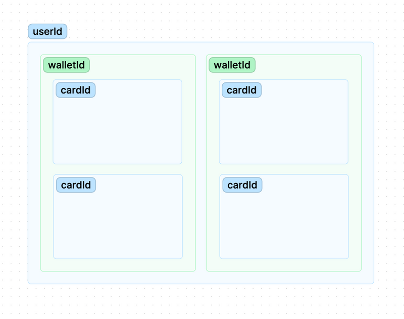

# API
## <h2><strong>Intro</strong></h2>

Welcome to the Paycaddy API documentation, a comprehensive and flexible platform designed to enable businesses and developers to easily integrate banking and financial services into their applications and systems.

Our API is built as a REST interface. The main benefit is that it accepts form-encoded request bodies and returns JSON-encoded responses, using standard HTTP response codes which should make our API familiar to anyone with previous experience using APIs.

From this point on and using this documentation as a guide, you should be able to integrate and test calls for:

- Creating natural and legal type users. (Check **[Users](#users)**)
- Creating wallets for each user you create. This option will be useful if you are going to integrate pre-funded credit type cards or if you want to manage more than one wallet per user. (Check **[Wallets](#wallets)**)
- Managing balances of wallets created through PayIns, PayOuts, and transfers between wallets. (Check **[Wallet Operations](#wallet-operations)**)
- Creating cards linked to the created wallets. (Check **[Cards](cards)**)
- Managing created cards. (Check **[Card Operations](#card-operations)**)

It is important to highlight that the creation cards has different endpoints for debit, credit, and prepaid cards. In the initial exploration, our commercial team must have assigned you the specific details of the profiles of your card program, which will define to which endpoint(s) you should make calls for the creation of your cards, as well as a unique code for your assigned profile that should be included in the card creation calls.

---
## <h2><strong>Sandbox Access and Auth</strong></h2>
To start an integration process, you must first request integration API Keys by contacting (email address for this purpose). The API keys will be delivered via email to the technical responsible party.

Handling the keys is of great importance and it is the responsibility of the key recipient to keep them safe. Secret keys must not be shared on any publicly accessible site such as GitHub, client-side code, etc.

Authentication to the API should be performed via X-API Key. It is necessary to provide the API Key as the basic user value, without the need to provide a password.‍

All calls must be made via HTTPS; any call made via HTTP or without authentication will fail‍. 

With the integration credentials, you will be able to make calls to the NeoBank API testing environment directly. Our team will provide tools to test the endpoints as you develop your code towards our environments (you can choose between Swagger or Postman).

----
## <h2><strong>Entity Structure</strong></h2>

The NeoBank API has 3 fundamental entities with which you will interact each time you consume an endpoint to complete the various available flows. These entities identify the end users of the card issuance service, the wallets or virtual containers for money, and the cards associated with them.

{class="img"}

**UserID:** ‍Uniquely identifies an EndUser or MerchantUser interchangeably. The UserID is the primary entity of the NeoBank API. The process of creating an EndUser or MerchantUser always results in the creation of a UserID and, in turn, an associated WalletID.

‍
‍**WalletID:** The WalletID is the identifier of the electronic money container to which funds are credited and debited through PayIns, PayOuts, and/or transactions of the card(s) associated with it. A UserID will always be associated with at least one WalletID; however, it may contain multiple WalletIDs if required by the client's solution.
‍

**‍CardID:** ‍These are the unique identifiers of the card that also serve as an abstraction of the PAN of the issued cards, avoiding the need for storing sensitive card information.

---

## <h2><strong>Flow Overview</strong></h2>

The flows for using the NeoBank API are categorized based on the main entity they register, modify, or query. At a high level, the flows are correlated as explained bellow:
{class="img img-thin"}

---

## <h2><strong>User Flow</strong></h2>

The creation of new UserIDs in the NeoBank API follows two separate flows depending on the type of person to be entered into the system.

EndUser refers to the users created for natural persons.
MerchantUser refers to the users created for legal entities.

It is important to note that there are separate endpoints for creating EndUsers and MerchantUsers.
  
During the initial exploration, our sales team should have assigned you the specific details of your card program profiles, which will define which endpoint(s) you should call for user creation and the relevant KYC obligations.

{class="img"}

---

## <h2><strong>Card Flow</strong></h2>
The NeoBank API has differentiated calls for the creation of debit, credit, and prepaid cards. Through these calls, it is possible to create a physical or virtual card for an existing UserID linked to the available balance in a specific WalletID of that user.

All cards are created using a unique parameterization code for each card product, which must be previously requested from the PayCaddy integration team.

The creation of a card starts with the post debitCard POST, creditCard POST or prepaidCard POST call, depending on the acquired issuance service.

It is important to consider the type of user for which the card has been parameterized. Cards parameterized for natural persons can only be created by associating them with UserIDs representing EndUsers, while those parameterized for legal entities can only be created by associating them with MerchantUsers.

Once you have been granted a card creation code, you can begin testing card creation in the test environment.

---
## <h2><strong>Credit Flow</strong></h2>
For credit card issuance programs that use credit lines, the endpoints below will be used to manage the funds made available in the wallets associated with each credit line.

If the cards are prepaid credit, please see the <strong>wallet POST</strong> endpoint to create wallets that have the ability to create credit cards.

The credit operation follows the flow below and uses the endpoints detailed in this section.

{class = ".img"}
