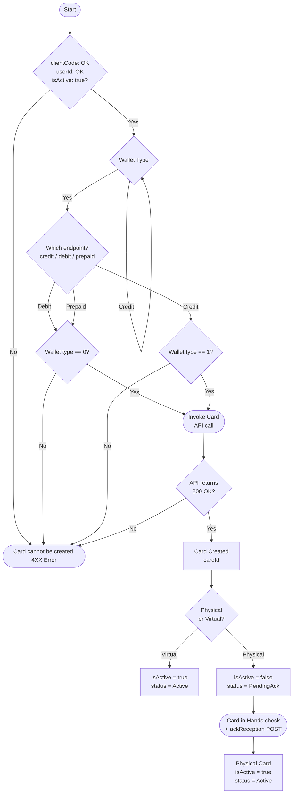

## **Flow Overview**

The flows for using the NeoBank API are categorized based on the main entity they register, modify, or query. At a high level, the flows are correlated as explained bellow:
{class="img img-thin"}

---

## **User Flow**

The creation of new UserIDs in the NeoBank API follows two separate flows depending on the type of person to be entered into the system.

EndUser refers to the users created for natural persons.
MerchantUser refers to the users created for legal entities.

>It is important to note that there are separate endpoints for creating EndUsers and MerchantUsers.

>During the initial exploration, our sales team should have assigned you the specific details of your card program profiles, which will define which endpoint(s) you should call for user creation and the relevant KYC obligations.

{class="img"}

---

## **Card Flow**

The NeoBank API has differentiated calls for the creation of debit, credit, and prepaid cards. Through these calls, it is possible to create a physical or virtual card for an existing UserID linked to the available balance in a specific WalletID of that user.

All cards are created using a unique parameterization code for each card product, which must be previously requested from the PayCaddy integration team.

The creation of a card starts with the post debitCard POST, creditCard POST or prepaidCard POST call, depending on the acquired issuance service.

>It is important to consider the type of user for which the card has been parameterized. Cards parameterized for natural persons can only be created by associating them with UserIDs representing EndUsers, while those parameterized for legal entities can only be created by associating them with MerchantUsers.

Once you have been granted a card creation code, you can begin testing card creation in the test environment.

---

## **Credit Flow**
For credit card issuance programs that use credit lines, the endpoints below will be used to manage the funds made available in the wallets associated with each credit line.

>If the cards are prepaid credit, please see the Wallet POST endpoint to create wallets that have the ability to create 
credit cards.

The credit operation follows the flow below and uses the endpoints detailed in this section.

